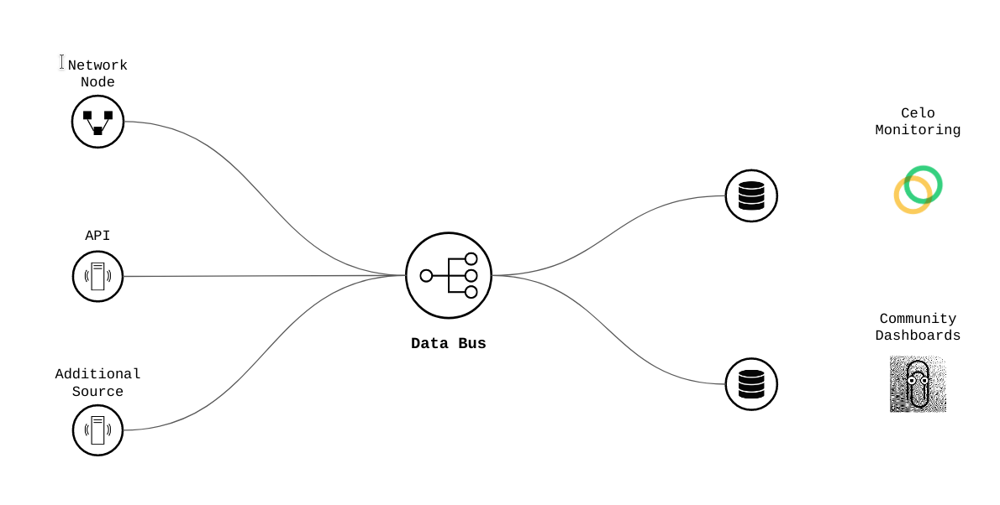
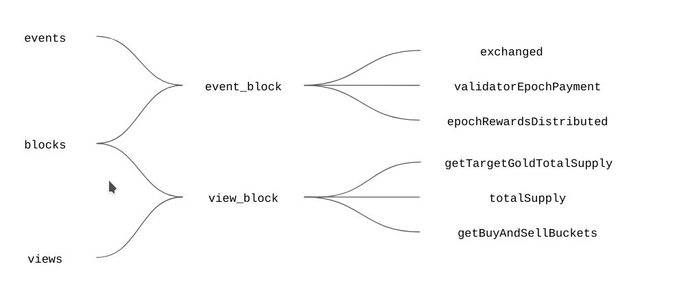
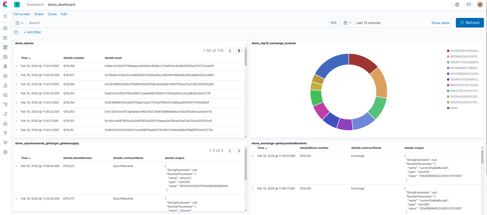

# Celo Web3 Monitoring 


   * [Celo Web3 Monitoring](#celo-web3-monitoring)
      * [Description](#description)
      * [Architecture](#architecture)
         * [Data](#data)
      * [How to run](#how-to-run)
         * [Components of the stack](#components-of-the-stack)
         * [How to run the Monitoring Agent](#how-to-run-the-monitoring-agent)
         * [Configuring the Agent &amp; other components](#configuring-the-agent--other-components)
         * [How to run the Celo Monitoring Engine](#how-to-run-the-celo-monitoring-engine)
         * [Celo Monitoring Engine Configuration](#celo-monitoring-engine-configuration)
         * [Monitoring Dashboard](#monitoring-dashboard)
      * [License](#license)


## Description

Celo Web3 Monitoring provides a solution helping to analyze what is happening in the Celo Network.
It allows to ingest, transform & persist multiple sources of data facilitating further analysis and data consumption.

In the existing version the solution ingest the following data coming from a Celo network node:

    - Blocks minned
    - Events emitted from Celo Smart Contracts
    - State of public variables (views)
    - Transactions

The solution is flexible to support the ingestion of additional sources of data (data from custodian services, API's, databases, websockets, etc.)
 and combine/enrich/analyze with other sources of data in real time.  



## Architecture

The solution architecture it's based in Keyko Web3 Monitoring Platform and using the following Open Source components:

- Keyko Web3 Monitoring Agent - Ingestion agent able to connect a network node and ingest all the data related to blocks, events, transactions and public state. The agent is configurable via API, allowing to extend the elements to fetch from the network.
- Celo Monitoring Engine - Small processors in charge of data cleansing, cataloging and transformation facilitating further analysis and visualization. Based in Keyko Events Streamer framework.
- Data Backbone -  Event driven data bus keeping all the incoming data and facilitating the event transformation and further persistence in real-time. Based in Kafka and Schema Registry of Confluent.  

For storage  and visualization purposes, the processed data is saved in Elastic Search. Dashboards facilitating the visualization are built using Kibana.

Further details can be found in the [architecture documentation page](docs/architecture.md).

### Data

The [Keyko Web3 Monitoring Agent](https://github.com/keyko-io/web3-monitoring-agent) allows to configure the data to ingest connected to a network node. 
This data include blocks, events, state variables and transactions. Complementary to this, the architecture supports the ingestion of different sources of data, allowing to combine, enrich, aggregate multiple sources of data and generate relevant insights.

Different possibilities of incoming data are:

    - External API's, for example the REST API of a custodian service.
    - Databases
    - Websocket information, allowing to retrieve the information emitted by CeloStats
    - Etc

Bespoke agents could be created to support the ingestion of any kind of source.

In the current setup, the following network information is ingested in different topics:

    - w3m-block-events - blocks minned by the network
    - w3m-contract-events - trigered events matching with the user configuration
    - w3m-contract-views - result of calling public views matching with the user configuration
    
Using the incoming data, the Celo Monitoring Engine is augmenting/enriching the 
information of each event and view result with the information of the block when 
this event was emitted or when the information from public view was fetched.

After of that, each event and view result data is split in independent topics. 
At this point additional analysis, alerts, aggregations, etc could be implemented. 
Allowing to monitor individual indicators in real time.



In the current setup, we are sending all the generated information to Elastic Search for further consumption.
The data collector is able to detect all the topics with the suffix `_elastic`, sending the events
in real time to independent Elastic Search indices.

For example:

    - w3m-epochrewards-gettargetgoldtotalsupply_elastic
    - w3m-exchange-getbuyandsellbuckets_elastic
    - w3m-exchanged_elastic

You can find a complete list of the data generated by the system in the following [data documentation page](docs/data.md).

## How to run

### Components of the stack

You need to have running the following components:

- Kafka
- Zookeeper
- Schema Registry
- Keyko Web3 Monitoring Agent
- Elastic Search
- Kibana
    
You can have all of them running with the docker-compose.yml in the folder `docker` and using next command:

```bash
bin/run-monitoring.bash start
```

Starting the all the components will take a few minutes, you can check if everything is up running:
```bash
bin/run-monitoring.bash status
```

### How to run the Monitoring Agent

When all the components look okay, you can proceed to start the [Keyko Web3 Monitoring Agent](https://github.com/keyko-io/web3-monitoring-agent). 
You can use the Docker image or compiling/running directly the application:

```bash
cd /path/to/web3-monitoring-agent
mvn clean package
ETHEREUM_NODE_URL=http://localhost:8545 java -jar server/target/web3-monitoring-agent-*.jar --spring.config.location=file:server/src/main/resources/application.yml
```

At this point without further configuration, the agent is ingesting blocks and sending to Kafka.
You can check the agent is sending the blocks listening directly from the Kafka topic:

```bash
bin/run-monitoring.bash read-topic w3m-block-events
```

Each 5 seconds approximately you should see a new line representing a block ingested in the system.

### Configuring the Agent & other components

As was said above, the monitoring agent can ingest blocks, transactions, events and the state of public views. This configuration can be made easily via REST Api.
For loading the configuration allowing to ingest the information required for the Celo use cases, run the following commands:

```bash
# Install Newman
npm install -g newman

# Run the API agent requests
bin/run-monitoring.bash config 
```

The above step is also in adding the Kafka Connect & Elastic Search configuration to move the output data from Kafka to Elastic.

You can check the agent is reading the information when the configured events are triggered directly from the Kafka topic:

```bash
bin/run-monitoring.bash read-topic w3m-contract-events
```

You can check the agent is reading the information pulled from public views listening directly from the Kafka topic:

```bash
bin/run-monitoring.bash read-topic w3m-contract-views
```

The rules for ingesting public views have different block intervals (between 5 and 25 blocks), so it could take a couple of minutes till you see some data comming to Kafka.


### How to run the Celo Monitoring Engine

The rules implementing the Celo use cases are included as part of this repository. 
The Celo Monitoring Engine uses the Open Source [Keyko Web3 Events Streamer framework](https://github.com/keyko-io/web3-event-streamer/). 
The easy way to compile and start running the processing is using the following commands:

```bash
mvn clean package
java -jar target/celo-monitoring-engine.jar 
```

### Celo Monitoring Engine Configuration
The priority in the management of the configuration is to pass the java property in the following way:
```-Dkafka.sink-suffix="_elastic"```
If you are not passing in that way you can configure in your application conf to get the values as a environment variable. 
To do that you have to pass the configuration in the following way and set the corresponding variable doing an `export SINK_SUFFIX=_elastic`:
```hocon
kafka{
sink-suffix=${?SINK_SUFFIX}
}
``` 
The other option is simple make the substitution in the application.conf file.

### Monitoring Dashboard

All the data should be persisted automatically in Elastic Search. You should be able to check that data is available there with some of this urls:

```
# Exchange.getBuyAndSellBuckets view 
http://localhost:9200/w3m-exchange-getbuyandsellbuckets_elastic/_search?q=*

# GoldToken.totalSupply view
http://localhost:9200/w3m-goldtoken-totalsupply_elastic/_search?q=*

# Exchanged event
http://localhost:9200/w3m-exchanged_elastic/_search?q=*
```

Also it's available a Kibana dashboard showing some data with the information available:
http://localhost:5601/app/kibana#/dashboards




## License

```
Licensed under the Apache License, Version 2.0 (the "License");
you may not use this file except in compliance with the License.
You may obtain a copy of the License at

   http://www.apache.org/licenses/LICENSE-2.0

Unless required by applicable law or agreed to in writing, software
distributed under the License is distributed on an "AS IS" BASIS,
WITHOUT WARRANTIES OR CONDITIONS OF ANY KIND, either express or implied.
See the License for the specific language governing permissions and
limitations under the License.
```

