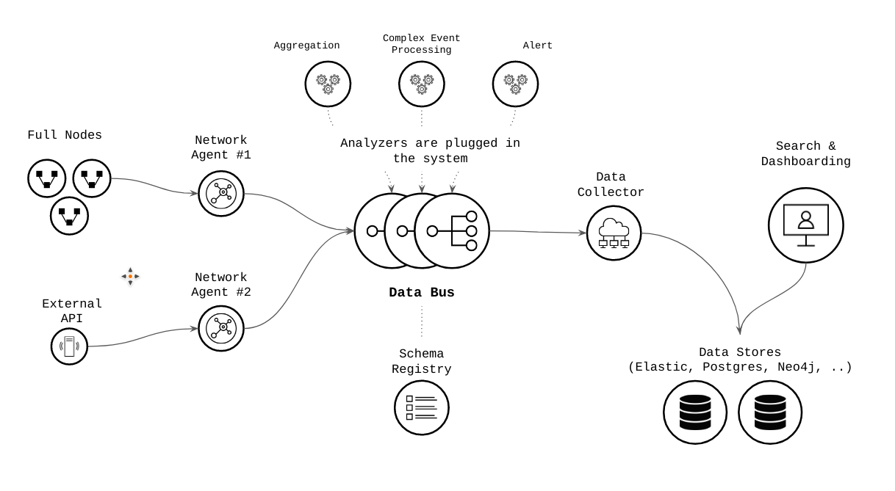
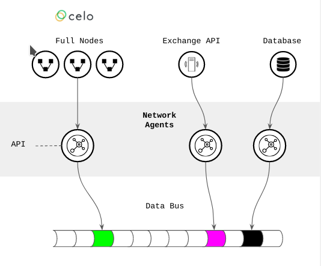
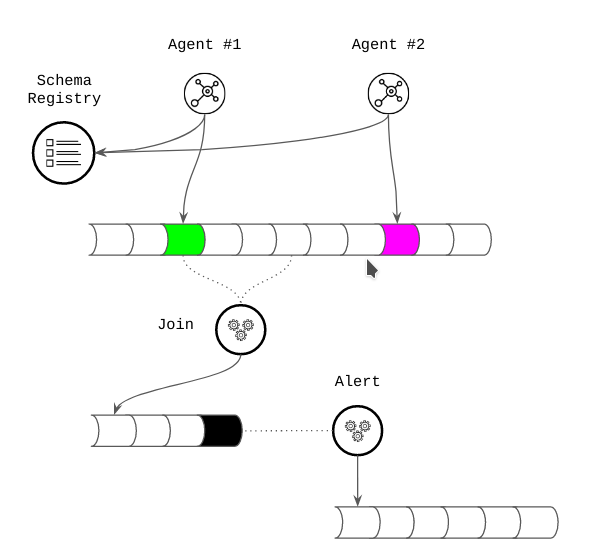

# Celo Monitoring Architecture

```
shortname:      ARCH
name:           Celo Monitoring Architecture
status:         Draft
version:        0.1
editor:         Aitor Argomaniz <aitor@keyko.io>
contributors:   
```

**Table of Contents**

   * [Celo Monitoring Architecture](#celo-monitoring-architecture)
      * [Motivation](#motivation)
      * [Architecture](#architecture)
         * [Ingestion Agents](#ingestion-agents)
            * [Celo Network Agent](#celo-network-agent)
            * [Other Agents](#other-agents)
         * [Transport Layer](#transport-layer)
            * [Schema Registry](#schema-registry)
         * [Transformation](#transformation)
         * [Data Collector](#data-collector)
         * [API and Visualization](#api-and-visualization)
      * [Technical Components](#technical-components)
         * [Operation and Maintenance costs](#operation-and-maintenance-costs)
      * [References](#references)
      * [Language](#language)


---


## Motivation

This document describes the architecture decisions made during the design process of the Celo Monitoring tool.
The main motivations of the Celo monitoring tool are:

* Design a end to end solution able to surface the most relevant network health KPIs allowing 
  to take decisions with the information given
* Facilitate to the Protocol Economics team to understand the health of the network in real time
* Provide a solution that allows to engage the community. Supports the delivery of information and 
  knowledge to the community, opening the possibility of users engagement.
* Provide an architecture able to scale, avoiding to re-architect the solution in the short term 
* Flexible & easy to ingest from multiple sources of data
* Facilitate to get benefit of the existing data and build insights and alerts 
* Allow to consolidate and export the data ready to be used internally (Circles, ) or with the 
  external community (validators, users, ..)
* Promote the transparency and facilitates to engage the community allowing them to build on top of Celo
* Provide a solution reducing the operational and maintenance costs
* Provide a solution using only [FLOSS (Free Libre Open Source Software)](https://www.gnu.org/philosophy/floss-and-foss.en.html)

## Architecture

Based in the above motivations, the architecture provides an end to end data pipeline where:

- The data can be ingested/extracted from different sources
- The data is sent to highly-available and resilient data bus
- Generic transformation drivers clean, catalog, enrich and process the information in real-time
- The information generated from the input data is sent automatically to the persistence layer
- The information is stored and can be visualized by different kind of users
 


The solution architecture it's based in the following building blocks:

- Ingestion Agents - Agents able to connect to different sources.
  Initially using an agent connected to a Celo network node. It ingests all the data related to blocks, events, transactions and public state. 
  The agent is configurable via API, allowing to extend the elements to fetch from the network.
- Data Backbone -  Event driven data bus keeping all the incoming data and facilitating the event transformation 
  and further persistence in real-time.
- Celo Monitoring Engine - Small processors in charge of data cleansing, cataloging and transformation facilitating 
  further analysis and visualization.
- Storage and Visualization - Provides the capabilities of persist the information generated and visualize it in an easy way.




### Ingestion Agents

Ingestion agents are deployed in high availability and connected to network full nodes or external systems (WebSocket, Databases, Services, ..).
They are in charge of capture the data from the source system and send to the data backbone for further processing. 




#### Celo Network Agent

Initially the main agent available in the system is the `Celo Network Agent`. 
It's a programmable agents ingesting data from Celo network (blocks, transactions, events, public state of Smart Contracts).
This agent is provided using the [Keyko Web3 Monitoring Agent](https://github.com/keyko-io/web3-monitoring-agent) (Apache v2 License). 
More information about how to subscribe to events, transactions and views of the public state can be found in 
the [API doc page](https://github.com/keyko-io/web3-monitoring-agent/blob/master/doc/api.md).

Some agent features:
 
- Failover support - If the agent stops and it's started again it recovers from the last block processed
- Replay - The agent can start to read from any block specified by the agent operator. It allows to "replay" the whole network from block 1
- Dynamically Configurable - It exposes a REST api so that smart contract events/views can be dynamically subscribed / unsubscribed.
- Highly Available - The instances communicate with each other to ensure that every instance is subscribed to the same collection of smart contract events.


#### Other Agents

Because the open design of the data backbone and the architecture, additional agents can be implemented to capture data from different sources.

### Transport Layer

It is provided by a Data Bus or Data Backbone. It persists the incoming data in real time supporting 
the ingestion of millions of events per second. 
In the transport layer the data is organized in independent topics, that can be used for consuming the 
data from independent users in different ways.
The transport layer is independent of the ingestion, processing or persistence layers.
Based on Apache Kafka and Schema Registry Open Source projects.

#### Schema Registry

It keeps the schemas of all the different event types going through the transport layer. 
The Transport Layer is integrated with a Schema Registry, and allows to manage the versions of the different data schemas, 
giving support to schema validation, evolution and backward compatibility.
It provides an API with the solution schema metadata, allowing for third-components to validate the schemas of the incoming messages.


### Transformation

It uses small agents to consume and transform the data in real time. 
It allows generate information & insights from all the different incoming data. Supports the implementation of the following use cases:

- Cleansing, filtering and cataloging of incoming data
- Preparation of the information for further persistence in different data stores
- Joining of events in real time of independent topics
- Data enrichment with external sources of information
- Alerts detection
- Materialised Views
- Complex Event Processing
- The combination of all the above 





### Data Collector

Retrieves the information in real time from different transport layer topics and persist in different data stores.
Allows a basic adaptation of the events allowing to persist in ElasticSearch, MongoDB, PostgreSQL, Big Query, etc. 
The same information and insights can be sent to different data stores adapted to different consumers 
(internal to Celo or to be used by the community)

### API and Visualization

Having the data in different data stores, this layer allows the easy consumption of the data by different users.
Dashboards can be built using different solutions allowing users to consume the information in different ways 
via specific visualizations. 
Depending on the nature of the data this can be consumed via user queries, graphs and tables.


## Technical Components

The current solution is using the following technical components (all of them Open Source):

- Ingestion Agent:
  * [Keyko Web3 Monitoring Agent](https://github.com/keyko-io/web3-monitoring-agent)
- Transport Layer:
  * [Apache Kafka](https://github.com/apache/kafka/)
  * [Schema Registry](https://github.com/confluentinc/schema-registry)
- Transformation Layer:
  * [Kafka Streams](https://kafka.apache.org/documentation/streams/)
- Data Collector:
  * [Kafka Connect](https://kafka.apache.org/documentation/#connect)
- Visualization & API:
  * [Elastic Search](https://github.com/elastic/elasticsearch)
  * [Kibana](https://github.com/elastic/kibana)

### Operation and Maintenance costs

All the technical components part of the architecture can be executed as a service as part of the Google Cloud Platform:

- https://www.elastic.co/elasticsearch/service
- https://www.confluent.io/blog/announcing-confluent-cloud-for-apache-kafka-native-service-on-google-cloud-platform

It reduces the costs of operation and maintenance of the solution and allows to scale out without increasing the complexity
of the current infrastructure operations.


## References

* [FLOSS (Free Libre Open Source Software)](https://www.gnu.org/philosophy/floss-and-foss.en.html)
* [Elastic and Kibana as a Service](https://www.elastic.co/elasticsearch/service)
* [Conflient stack (Kafka & co.) as a Service in GCP](https://www.confluent.io/blog/announcing-confluent-cloud-for-apache-kafka-native-service-on-google-cloud-platform)

## Language

The key words "MUST", "MUST NOT", "REQUIRED", "SHALL", "SHALL NOT", "SHOULD", "SHOULD NOT", "RECOMMENDED", "NOT RECOMMENDED", "MAY", and "OPTIONAL" in this document are to be interpreted as described in [BCP 14](https://tools.ietf.org/html/bcp14) \[[RFC2119](https://tools.ietf.org/html/rfc2119)\] \[[RFC8174](https://tools.ietf.org/html/rfc8174)\] when, and only when, they appear in all capitals, as shown here.
